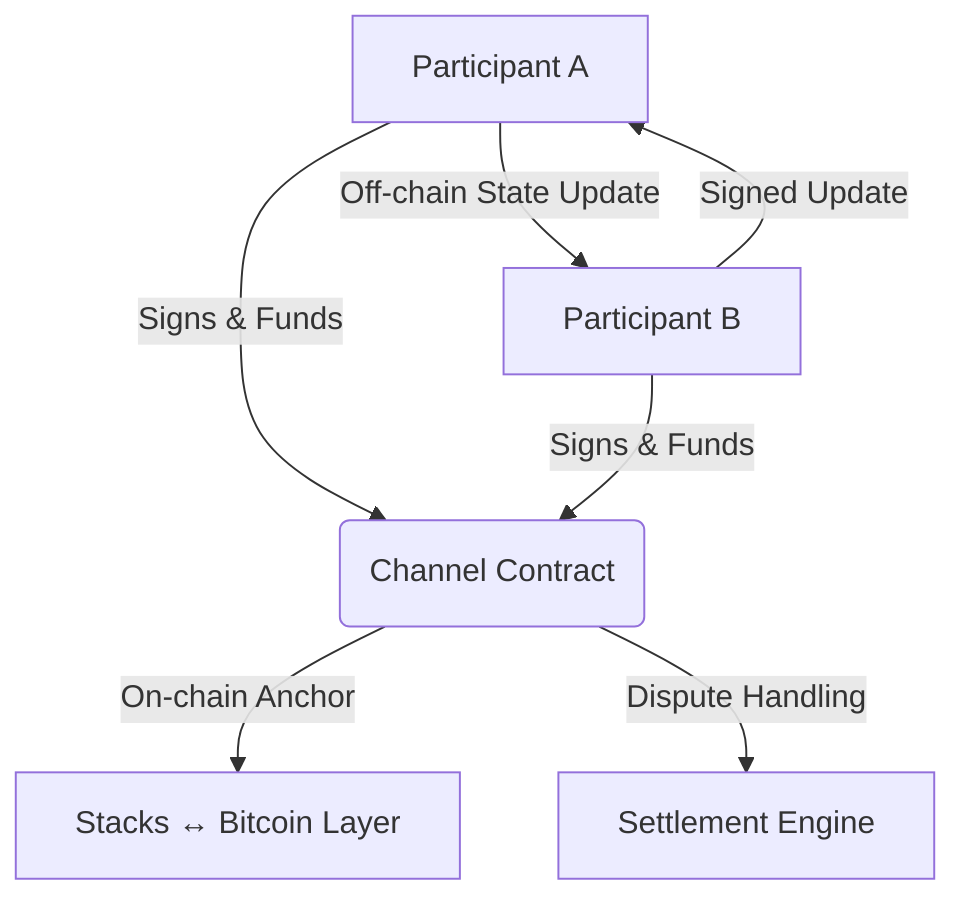

# ⚡ Lightning Loop: Bitcoin-Native Payment Channel Protocol for Stacks

**Lightning Loop** is a secure, scalable payment channel implementation for the [Stacks](https://stacks.co) blockchain. It enables **high-throughput off-chain transactions** with **Bitcoin-level finality** through on-chain settlement, designed for decentralized applications, microtransactions, and fast peer-to-peer payments.

## 📌 Summary

Lightning Loop facilitates **bi-directional two-party payment channels** with support for:

* Channel creation, funding, and balance updates
* Off-chain signed state transitions
* Cooperative and unilateral channel closure
* Built-in dispute resolution and recovery mechanisms

It reduces on-chain congestion, supports satoshi-level precision, and maintains strong security via digital signatures and nonce protection.

## 🧱 Key Features

* 🔐 **Bitcoin-Native Security**: Anchored to Bitcoin through Stacks’ consensus.
* ⚡ **Fast Off-Chain Transactions**: Near-instant updates, no chain interaction required.
* 📄 **Dispute-Resistant Design**: Enforced closure windows and state challenge system.
* 🛠 **Lifecycle Support**: Complete API for managing the full channel lifecycle.
* 🧾 **Non-Custodial**: Funds are locked in user-controlled smart contracts.
* 🧰 **Emergency Recovery**: Admin recovery option for catastrophic cases.

## 🛠️ Architecture Overview



* **Participants**: Two users with Stacks wallets exchanging signed state updates
* **Channel Contract**: Holds state, enforces rules, settles balances
* **Settlement Engine**: Handles cooperative or unilateral closure with optional disputes

## 🔁 Protocol Lifecycle

1. `create-channel` – Deploy a new channel with an initial deposit.
2. `fund-channel` – Add funds to an open channel.
3. **Off-chain Phase** – Parties exchange signed balance states and increment a shared nonce.
4. `close-channel-cooperative` – Mutually close the channel with both signatures.
5. `initiate-unilateral-close` – Start closure unilaterally; triggers dispute window.
6. `resolve-unilateral-close` – Finalize closure after dispute period.
7. `emergency-withdraw` – Admin-only function to recover locked funds in emergencies.

## 📄 Smart Contract Functions

| Function                    | Purpose                                                 |
| --------------------------- | ------------------------------------------------------- |
| `create-channel`            | Initializes a payment channel with both participants    |
| `fund-channel`              | Adds additional funds to a channel                      |
| `close-channel-cooperative` | Finalizes the channel with mutual agreement             |
| `initiate-unilateral-close` | Allows one user to start closing the channel alone      |
| `resolve-unilateral-close`  | Resolves the channel after timeout if no contest arises |
| `get-channel-info`          | Returns current channel state                           |
| `emergency-withdraw`        | Admin-only safeguard for fund recovery                  |

## 🚀 Getting Started

### 🔧 Prerequisites

* [Clarinet](https://docs.stacks.co/clarity/clarinet) (Clarity development toolkit)
* Stacks wallet with STX tokens (testnet or mainnet)
* Familiarity with Clarity and principal identities

### 📦 Installation & Deployment

```bash
# Validate and test contract
clarinet check
clarinet test

# Deploy to testnet
clarinet deploy --testnet
```

## 📚 Example Usage

### 1. Channel Creation

```clarity
(create-channel 0x1234abcd 'SP3BZ... 5000000)
```

### 2. Off-Chain State Update (Exchanged Between Users)

```json
{
  "channel_id": "0x1234abcd",
  "balance_a": 4500000,
  "balance_b": 500000,
  "nonce": 42,
  "signatures": ["0xSigA", "0xSigB"]
}
```

### 3. Cooperative Close

```clarity
(close-channel-cooperative 
  0x1234abcd 
  'SP3BZ... 
  4500000 
  500000 
  0xSigA 
  0xSigB)
```

### 4. Unilateral Close

```clarity
(initiate-unilateral-close 
  0x1234abcd 
  'SP3BZ... 
  4500000 
  500000 
  0xSigA)
```

## 🔐 Security Model

| Protection Mechanism       | Description                                                      |
| -------------------------- | ---------------------------------------------------------------- |
| **Signature Verification** | All updates require valid ECDSA digital signatures               |
| **Nonce System**           | Prevents replay attacks by enforcing strictly increasing state   |
| **Dispute Period**         | Default 7-day timeout to challenge unilateral closures           |
| **Role Restrictions**      | Only participants can modify state; only admin can recover funds |

## ⚙️ Compliance & Auditing

* 💼 **STX/SIP-021 Token Compatible**
* 📜 **Bitcoin Script-Aligned Settlement Rules**
* 🔍 **Regular External Audits Recommended**
  *(Especially for mainnet deployments)*

## 👥 Contributing

We welcome pull requests and issues!

1. Fork the repository
2. Create a new branch: `git checkout -b feature/your-feature-name`
3. Make changes with `Signed-off-by` commits
4. Push and open a PR for review
